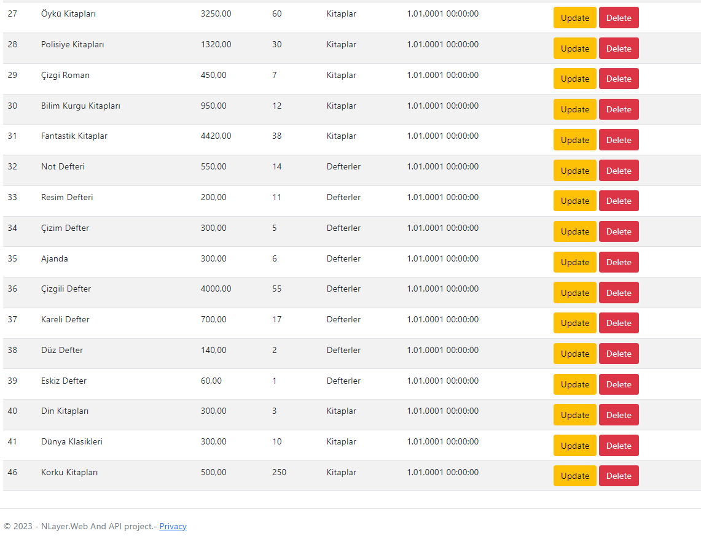
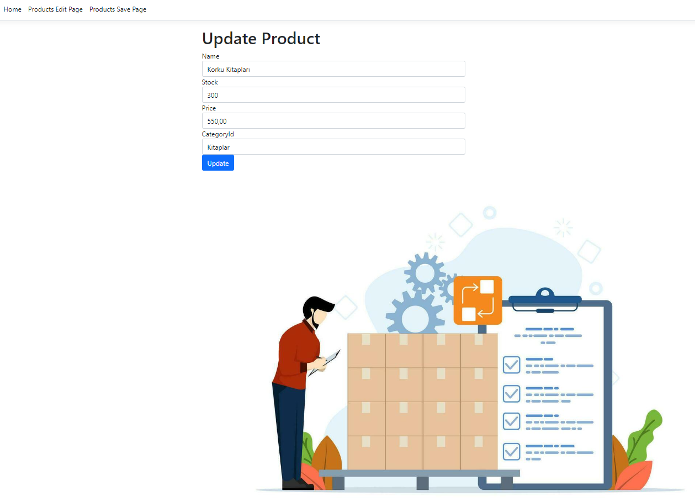
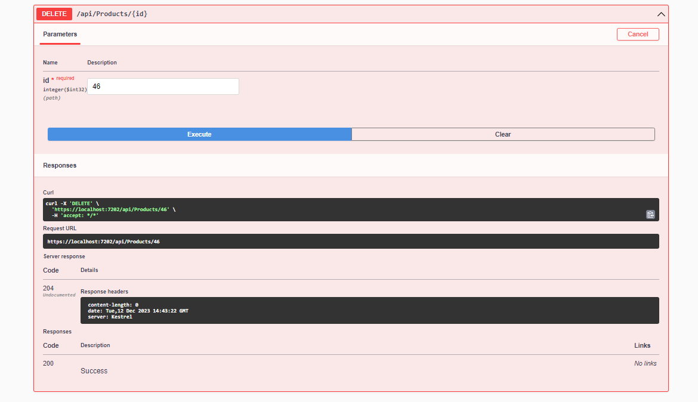

AspNet Core Web/API + Çok Katmanlı Mimari kullanarak sıfırdan bir uygulama inşaa ettim. Projemi; AutoMapper, UnitOfWork, AutoFac, FluentValidation ve Dto gibi bir çok noktayı ele alarak oluşturmaya özen gösterdim.//I built an application from scratch using ASPnet Core Web/API + N-Tier Architecture. I took care to create my project by addressing many points such as AutoMapper, UnitOfWork, AutoFac, FluentValidation and Dto.

Visual

Index

MVC and Swagger(GET-PUT-DELETE-SAVE-UPDATE)

-Get-

-Save-

-Put and Update-

-Delete

